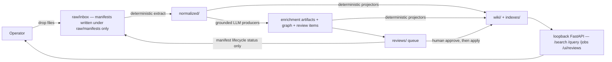

# UAT Guide

A thin user-acceptance checklist. It deliberately does not restate architecture or process
detail — the canonical references are:

- `docs/Workflow.md` — the pipeline (ingest → enrich → review → query) and day-to-day commands.
- `docs/Operations.md` — starting the app, maintenance passes, and the executor-backed apply types.
- `docs/Architecture Overview v0.1.md` — architecture and design principles.
- `docs/Environment Setup v0.1.md` — environment; §14.1 is the embedding backend install (ADR-0053).

## Safety model — disposable vault by default

The steps below mutate `raw/inbox/`, `raw/manifests/`, `normalized/`, `wiki/`, `indexes/`, `db/`,
and `reviews/`. They are **not** a safe default procedure for a live vault. Run the checklist in a
**disposable clone**; the live vault gets only the clearly labeled
[live-vault smoke path](#live-vault-smoke-path-optional) at the end.

One high-level map (detail lives in `docs/Workflow.md`):



LLM output never writes `wiki/` directly — grounded producers write artifacts/graph/review items and
deterministic projectors render pages. Nothing under `raw/` is written except `raw/manifests/`
(plus manifest lifecycle status on approved apply).

## 1. Create the disposable vault

```bash
git clone /home/jolulop/code/knowledge-system /tmp/ks-uat
cd /tmp/ks-uat
uv sync --all-extras
```

All commands below run from the clone root (`/tmp/ks-uat`).

Configuration in the clone:

- A fresh clone has **no `.env`** (it is gitignored), so the clone itself is the vault root. Create
  the clone's own `.env` (§1.2 below), or export only what a step needs in your shell:
  `ANTHROPIC_API_KEY` for step 6 (enrich), `EMBEDDING_*` for step 5 (vector).
- **If you copy your live `.env` into the clone, delete its `KNOWLEDGE_SYSTEM_HOME=` line** (or point
  it at the clone). The live value redirects every script in the clone back at the **live vault**.

### 1.1 GPU embedding stack — install the torch overlay in the clone

The default embedding backend (ADR-0053) is **in-process** (`EMBEDDING_PROVIDER=flagembedding_bge_m3`)
— there is no embedding server to run. But the GPU stack is an **out-of-lock overlay**: the `uv sync`
above deliberately does not install it, so the clone cannot embed until you install it into the
clone's venv (canonical commands and rationale: `docs/Environment Setup v0.1.md` §14.1):

```bash
cd /tmp/ks-uat
source .venv/bin/activate

uv pip uninstall -y torchvision torchaudio   # must be absent (torchvision::nms import error)
uv pip install torch --index-url https://download.pytorch.org/whl/cu128
uv pip install -U FlagEmbedding sentence-transformers transformers accelerate
```

`torch` must come from the CUDA 12.8 wheel index — a plain PyPI resolve pulls a CPU build. The first
embedding run downloads `BAAI/bge-m3` (~2 GB) into the Hugging Face cache (`~/.cache/huggingface`
when `EMBEDDING_CACHE_DIR` is unset), which is shared with the live checkout — no per-clone
re-download. `local_http` is the CPU/HTTP fallback and is the only mode that needs a running
embedding server.

### 1.2 Clone `.env` — what embeddings need

```bash
cp '/home/jolulop/code/knowledge-system/.env (UAT)' ./.env
```

Create `/tmp/ks-uat/.env` by hand. GPU embeddings need the `EMBEDDING_*` block below (same values as
`.env.example`); add `ANTHROPIC_API_KEY` only if you will run the billable steps (6, and `POST /query`
in 8). Keep comments on their own lines.

```dotenv
# Do NOT set KNOWLEDGE_SYSTEM_HOME here: left unset, the clone root is the vault root.
# A carried-over live value redirects every script in the clone back at the LIVE vault.

# LLM key — only for step 6 (enrich) and POST /query in step 8; omit for a key-free UAT.
ANTHROPIC_API_KEY=

# Embedding backend (ADR-0053): in-process FlagEmbedding BGE-M3 on CUDA.
EMBEDDING_PROVIDER=flagembedding_bge_m3
EMBEDDING_MODEL_ID=BAAI/bge-m3
EMBEDDING_DEVICE=cuda
EMBEDDING_USE_FP16=true
EMBEDDING_BATCH_SIZE=16
EMBEDDING_MAX_LENGTH=8192
EMBEDDING_DIMENSION=1024
EMBEDDING_DISTANCE_METRIC=cosine
```

With this provider and `EMBEDDING_DEVICE=cuda`, the served app (step 7) loads BGE-M3 once at startup
and **fails fast** if CUDA or the model load fails; ingest/review/lint runs never import torch.

Verify the overlay + config before the vector step:

```bash
uv run python scripts/check_embedding.py   # expect: dense_vecs shape: (3, 1024)
```

## 2. Preflight

```bash
git status --short
uv run ruff check app/ scripts/ tests/
env $(env | sed -n 's/^\(EMBEDDING_[A-Z0-9_]*\)=.*/-u \1/p') uv run pytest -q
uv run python scripts/validate_all.py
```

The `env -u` loop strips **every** `EMBEDDING_*` shell variable (current and future keys alike)
because several tests assert the unconfigured embedding state. Shell-stripping alone is a clean
embedding environment only where no `.env` re-supplies the keys — true in a fresh clone. In a
checkout that has a `.env`, the test suite still passes (tests run against temporary roots that
have no `.env`), but the **served app** reads that `.env`, so UAT app runs use its configuration.

## 3. Add files

Copy one or more real UAT documents into the inbox. Do not edit existing raw files.

```bash
mkdir -p raw/inbox
cp /path/to/your/test-file.pdf raw/inbox/
cp /path/to/your/test-file.md raw/inbox/
```

## 4. Deterministic build

```bash
uv run python scripts/scan_inbox.py
uv run python scripts/extract_sources.py
uv run python scripts/generate_wiki.py
uv run python scripts/reindex_keyword.py
uv run python scripts/rebuild_index.py
uv run python scripts/validate_all.py
```

Acceptance checks:

```bash
find raw/manifests -type f | sort | tail
find normalized/markdown -type f | sort | tail
find normalized/chunks -type f | sort | tail
find wiki/Sources -type f | sort | tail
sed -n '1,120p' wiki/index.md
```

## 5. Optional vector index

Only when your `EMBEDDING_*` environment is set (in-process default needs no server; see §1.1–1.2).

```bash
env | grep -o '^EMBEDDING_[A-Z0-9_]*' | sort
uv run python scripts/check_embedding.py
uv run python scripts/reindex_vector.py . --force
uv run python scripts/validate_vector_index.py .
```

## 6. Enrich (LLM-backed, billable)

Needs the configured provider key, normally `ANTHROPIC_API_KEY`.

```bash
uv run python scripts/enrich.py
uv run python scripts/extract_claims.py
uv run python scripts/extract_items.py
uv run python scripts/promote.py
uv run python scripts/detect_contradictions.py
uv run python scripts/generate_synthesis.py
uv run python scripts/reindex_keyword.py
uv run python scripts/rebuild_index.py
uv run python scripts/validate_all.py
```

Acceptance checks:

```bash
find wiki/Claims wiki/Items wiki/Tags wiki/Synthesis -type f 2>/dev/null | sort | tail -40
find reviews/pending -type f | sort | tail -40
```

## 7. Serve

Start the app in Terminal A and leave it running:

```bash
uv run python -m app.backend
```

In Terminal B:

```bash
export APP=http://127.0.0.1:18000
curl -fsS "$APP/health" | python3 -m json.tool
curl -fsS "$APP/sources" | python3 -m json.tool
curl -fsS "$APP/wiki/index" | head -80
```

## 8. Search and query

Set these to terms from one of your UAT documents.

```bash
TOPIC='your topic'
PHRASE='an exact phrase from a source'

curl -fsS --get "$APP/search" \
  --data-urlencode "q=$TOPIC" \
  --data-urlencode "mode=auto" | python3 -m json.tool

curl -fsS --get "$APP/search" \
  --data-urlencode "q=$PHRASE" \
  --data-urlencode "mode=keyword" | python3 -m json.tool

curl -fsS -X POST "$APP/query" \
  -H 'content-type: application/json' \
  -d "{\"question\":\"What does the vault say about $TOPIC?\",\"mode\":\"auto\",\"save\":false}" \
  | python3 -m json.tool
```

Notes:

- `POST /query` is LLM-backed and needs `ANTHROPIC_API_KEY` (same as step 6). Without a key it
  returns **503 with an actionable message** — drop curl's `-f` flag to see the detail body.
- `/search` returns **ranked top evidence**, not an exhaustive list of every matching document
  (caps come from `policies/retrieval.yaml`: by default 20 evidence + 20 navigation hits).
- Exact-phrase keyword search matches the **normalized Markdown**, not the PDF's visual text —
  verify a phrase with `grep -ril "the phrase" normalized/markdown/` before treating a miss as
  a search failure (PDF extraction artifacts such as line-break hyphenation can split words).

Acceptance checks:

- `/search` returns citable evidence for terms present in the documents.
- `/query` either cites retrieved evidence or abstains with `No source found in vault.`
  (with no key configured, a 503 with guidance is the expected behavior).
- Citations point to real `source_id` values and character anchors.

## 9. Review — scope-checked apply

`POST /reviews/apply` processes the **whole approved queue**, not one item. Even in a disposable
vault, drill the discipline you must use on a live vault: never apply until a dry-run proves the
approved queue contains exactly what you intend.

Inspect first (none of this mutates anything):

```bash
curl -fsS "$APP/reviews?status=pending&limit=20" | python3 -m json.tool
curl -fsS "$APP/reviews?status=approved&limit=20" | python3 -m json.tool
curl -fsS -X POST "$APP/reviews/apply/dry-run" | python3 -m json.tool
```

Browser UI:

```text
http://127.0.0.1:18000/ui/reviews
http://127.0.0.1:18000/ui/reviews/apply
```

Approve the intended UAT item (replace `<review_id>`):

```bash
curl -fsS -X POST "$APP/reviews/<review_id>/approve" \
  -H 'content-type: application/json' \
  -d '{"note":"UAT approval"}' | python3 -m json.tool
```

Re-run the dry-run and **verify `items[]` lists exactly the item(s) you intend — nothing else**:

```bash
curl -fsS -X POST "$APP/reviews/apply/dry-run" | python3 -m json.tool
```

Only if the queue scope is exactly as expected:

```bash
curl -fsS -X POST "$APP/reviews/apply" | python3 -m json.tool
uv run python scripts/validate_all.py
```

## 10. Maintenance jobs

Key-free, detect-and-propose passes — they write job records and may file review items, never apply.

```bash
curl -fsS -X POST "$APP/jobs/lint" | python3 -m json.tool
curl -fsS -X POST "$APP/jobs/reindex" | python3 -m json.tool
curl -fsS -X POST "$APP/jobs/stale-check" | python3 -m json.tool
curl -fsS "$APP/jobs?limit=20" | python3 -m json.tool
uv run python scripts/validate_all.py
```

## 11. Browse

Use Obsidian if available (`obsidian --no-sandbox &`) and open `/tmp/ks-uat/wiki` as the vault, or:

```bash
sed -n '1,160p' wiki/index.md
find wiki -maxdepth 2 -type f | sort | less
```

### Obsidian graph

The clone ships a committed graph-view preset (`wiki/.obsidian/graph.json`): the **Claims** layer is
filtered out (`-path:Claims`) and **Sources**/**Items** are color-coded, so the graph opens as a
readable ~120-node knowledge map instead of all ~460 pages. To see a page's claims, open it and use
**"Open local graph"** (command palette) rather than un-filtering the global view.

### Readable titles (optional community plugin)

Page **filenames stay id-keyed by design** (ADR-0060: `itm_…`, `clm_…`, `src_…`), so Obsidian's file
explorer, tabs, and graph label nodes by id out of the box. Wiki **links** already show titles via
`[[id|Title]]` aliases; to make the explorer/tabs/**graph** show `title:` frontmatter too, install the
**Front Matter Title** community plugin (not vendored in the repo — a deliberate supply-chain choice):

1. Settings → **Community plugins** → turn off Restricted mode → **Browse** → search *Front Matter
   Title* (by Snezhig) → Install → Enable.
2. In its settings, confirm the frontmatter field is `title` (the default), and turn **on** the
   **Graph** feature toggle (the File Explorer feature is on by default; Graph is off by default).

Titles then replace ids in the explorer, tab headers, and graph. This is per-clone (the plugin binary
is not committed); the graph preset above is committed and needs no setup.

## 12. Error-handling checks

These create UAT input data but do not edit existing raw files.

Unsupported file type:

```bash
printf 'unsupported UAT file\n' > raw/inbox/uat-unsupported.xyz
uv run python scripts/scan_inbox.py
uv run python scripts/extract_sources.py
curl -fsS "$APP/jobs?limit=5" | python3 -m json.tool
uv run python scripts/validate_all.py
```

Expected: the skip is reported in the **job output counts** (`skipped_unsupported` in the extract
job summary) — no extraction-log file is written for an unsupported extension, and the content is
never treated as an instruction.

Duplicate file:

```bash
cp /path/to/your/test-file.pdf raw/inbox/uat-duplicate-copy.pdf
uv run python scripts/scan_inbox.py
curl -fsS "$APP/sources" | python3 -m json.tool
```

Expected: duplicate bytes do not create a second source identity (one manifest, an added
occurrence), and validators remain the structural authority after each run.

## 13. Teardown

```bash
cd / && rm -rf /tmp/ks-uat
```

The clone is scratch state outside the live vault — deleting it is not a governed raw deletion,
and the live vault was never touched.

## Live-vault smoke path (optional)

A separate, deliberately minimal path for the **live** vault. It adds no documents, enriches
nothing, and applies nothing.

1. Back up first: `uv run python scripts/backup.py`
2. Status: `git status --short` and `uv run python scripts/validate_all.py`
3. Serve and read: `uv run python -m app.backend`, then `/health`, `/sources`, `/search`, and
   `POST /query` with `"save": false`.
4. Detect-and-propose only: `POST /jobs/lint` and `POST /jobs/stale-check` write job records and may
   **file** review items; they never apply anything.
5. **No enrichment, no approvals, and no `POST /reviews/apply`** on the live vault as part of a
   smoke pass — apply only as a deliberate governance act, after the step 9 dry-run scope check
   shows exactly the intended items.

## UAT acceptance checklist

- Raw bytes under `raw/` are not modified by processing; only `raw/manifests/` is written.
- Normalized Markdown and chunks are created for supported files.
- Source pages appear under `wiki/Sources/` with frontmatter and a summary callout.
- `wiki/index.md` rebuilds and links to generated pages.
- Keyword search returns expected evidence.
- Vector search works when configured (in-process backend by default — no embedding server).
- Query answers cite source chunks or abstain.
- Review items are decision-only until apply; the dry-run shows the intended scope before apply.
- Applying approved reviews updates only the governed surfaces and validators still pass.
- Maintenance jobs complete with reports and never act autonomously on semantic/destructive decisions.
- Teardown removes the entire disposable vault; the live vault is untouched.
